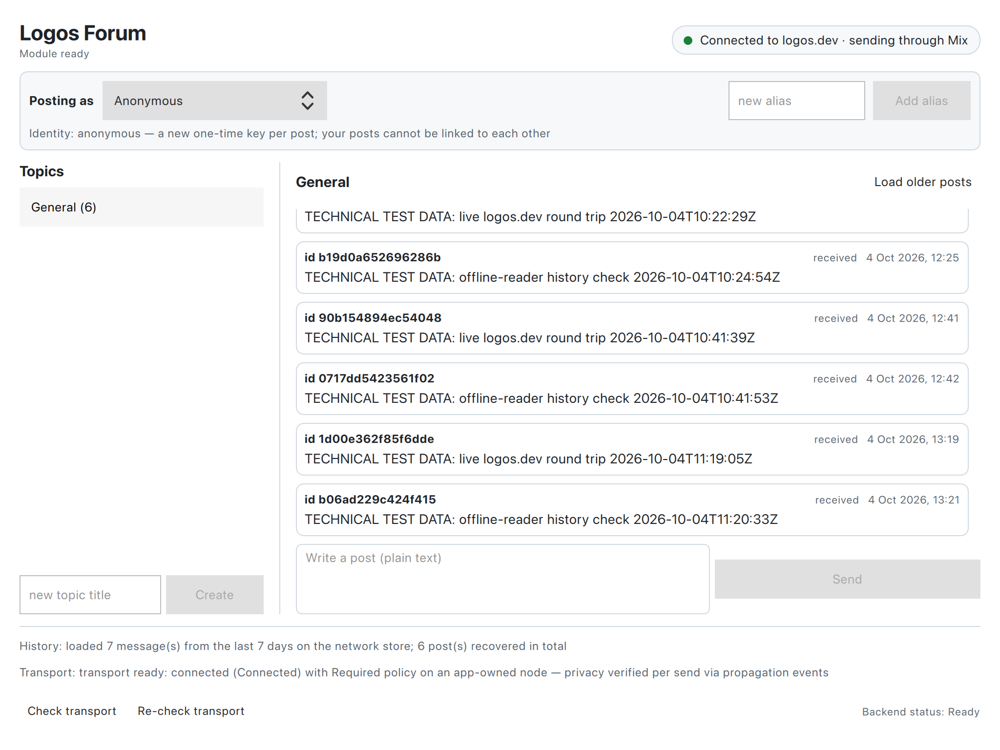
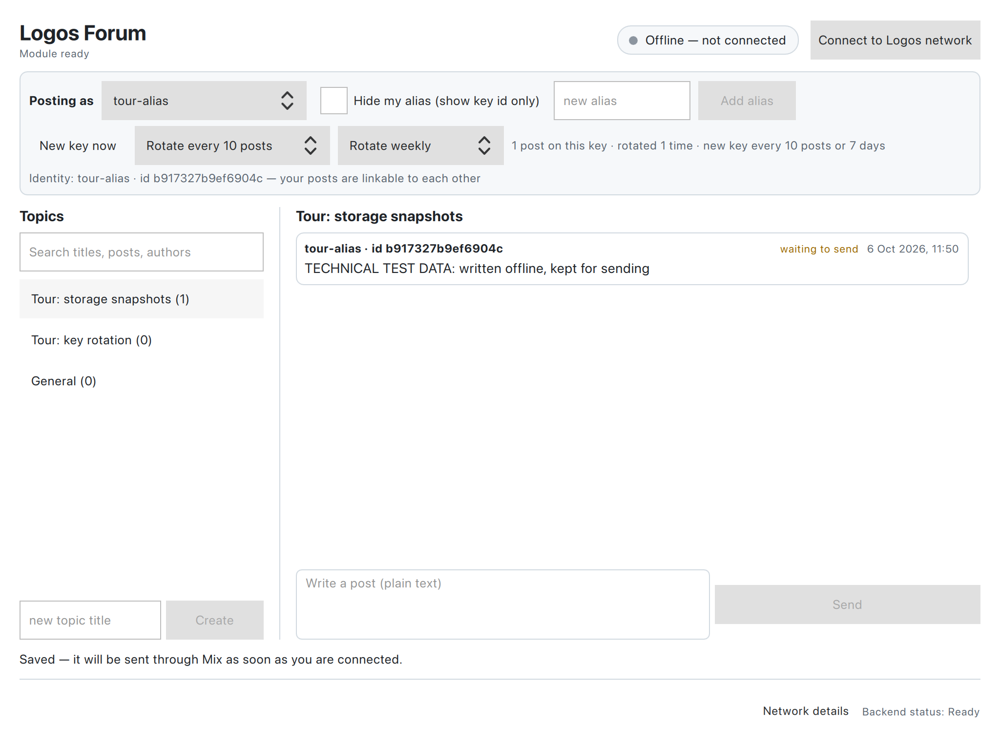

# Logos Forum (LP-0026)

A text-first forum for Logos Basecamp: accounts/pseudonyms with key
rotation, topics/replies, search and unread markers,
**privacy-required posting** (Required Mix — never a silent plain fallback),
**history after being offline** (the network's store, fetched in the app),
and **topic snapshots on Logos Storage** that anyone can restore and verify
— in the app, plus non-author archive roles with signed inventories.
Works on the public **logos.dev** network (receipted live:
`evidence/m6-live/`, `evidence/m7-storage/`). Dual-licensed **MIT + Apache-2.0**.



*Connected to the public logos.dev network after "Load older posts": the
posts are our own labelled test posts from the live receipts, recovered from
the network's store by a fresh instance.*



*An alias with automatic key rotation (every 10 posts or weekly; rotated once
by hand). Offline, the post is kept on the device and marked for sending.*

> Every claim in this README links to a receipt: `docs/MATRIX.md` maps each
> prize requirement to the logs under `evidence/` (sha256-bound). Current
> state, the full ledger of runs (failures included) and remaining
> limitations: `STATUS.md` → CURRENT STATE.

## Quick start (5 minutes, no build)

1. Install **Logos Basecamp 0.3.1** for your platform (macOS `.dmg`, Linux
   AppImage or Windows installer from the
   [Basecamp releases](https://github.com/logos-co/logos-basecamp/releases/tag/0.3.1)).
2. In Basecamp open **Package Manager** → add the repository
   `https://raw.githubusercontent.com/Tranquil-Flow/logos-forum-catalog/refs/heads/main/logos-repo.json`
   → install **Forum**. Its two dependencies,
   `delivery_module` 0.3.0 and `storage_module` 3.0.0, install with it.
3. Open **Forum** in the sidebar. To post under a name, type it in the
   *new alias* box under *Posting as* → **Add alias**; or keep *Anonymous*.
4. Press **Connect to Logos network**. Within seconds the chip reads
   *Connected to logos.dev · sending through Mix*.
5. Pick a topic (or create one), write, **Send**. Your post shows
   *sending…* then *sent*; posts from others appear as *received*.
   **Load older posts** fetches the last 7 days from the network.

Everything else — building from source, the test suites, the live
harnesses — is below.

## Pinned stack (docs/PINS.json)

| Component | Pin |
|---|---|
| logos-module-builder | 0.3.2 (`4b799827…`) |
| Logos Basecamp | 0.3.1 (`aeb8192…`) |
| logosctl | 0.3.1 (digest-verified); storage legs run on qualified 0.3.0 |
| Delivery module | v0.3.0 (`bec85943…`, lgx `f744f0f9…`) |
| Storage module | v3.0.0 (lgx `2af8cad7…`) |

## Build

Prerequisites: Nix with flakes. Nix ignores a flake's binary-cache settings
for non-trusted users, so add the Logos cache once (otherwise the pinned
Delivery/Storage closures compile from source, which takes hours):

```
# /etc/nix/nix.conf (then restart the nix daemon), or be a trusted user
extra-substituters = https://cache.nix.logos.co/public
extra-trusted-public-keys = public:l4HrXgL4nw246+LBh2SOJyhz64BoGegOYLheT/iIAPU=
```

```bash
cd lp0026-forum

nix build path:$PWD                 # module lib (Qt plugin + QML view)
nix build path:$PWD#lgx             # .lgx — dev variant (darwin-arm64-dev)
nix build path:$PWD#lgx-portable    # .lgx — release variant (darwin-arm64)
nix build path:$PWD#core-tests      # Qt-free domain tests (177 checks)
nix build path:$PWD#integration-test # hermetic UI suite (13 tests, store-backed)
nix build path:$PWD#ui-dev -o result-ui-dev   # dev launcher w/ QML hot reload
nix build path:$PWD#test-framework -o result-mcp
nix build path:$PWD#harness-python  # python3 + cryptography for tools/*
```

**Variant truth**: release-lineage hosts install `darwin-arm64` (macOS),
`linux-arm64`/`linux-amd64` (Linux, built by the same `#lgx-portable` on that
platform) or `windows-x86_64` (`packages.x86_64-windows.lgx-portable`, a
mingw cross build that runs on x86_64 Linux — CI job `windows`). CI merges
the macOS, Linux (amd64) and Windows packages into one multi-platform `.lgx`
(job `all-platforms`) — the form a catalog serves — and runs the Windows
package in the release Basecamp app on a Windows runner (job
`windows-basecamp`, `tools/windows_smoke.sh`, screenshots uploaded). Nix dev hosts require the `-dev` variant (`#lgx`).
Install the one matching your host (the wrong one is *refused*, never
half-loaded).

```bash
nix build 'path:.#packages.x86_64-windows.lgx-portable'   # on x86_64 Linux
```

## Verify

The live harnesses (protocol, storage, discovery, negatives) additionally
need the pinned dependency modules and a `logosctl` runtime under
`~/.local/share/lp0026-forum-dev/` (paths overridable via `FORUM_*` env
vars, see each tool's header). The dependency `.lgx` files are the official
catalog builds, sha256-pinned in `docs/PINS.json`:

```bash
D=~/.local/share/lp0026-forum-dev/downloads; mkdir -p "$D"
base=https://github.com/logos-co/logos-modules-release/releases/download
curl -fL -o "$D/delivery_module-0.3.0.lgx" "$base/delivery_module-v0.3.0/delivery_module-0.3.0.lgx"
curl -fL -o "$D/storage_module-3.0.0.lgx"  "$base/storage_module-v3.0.0/storage_module-3.0.0.lgx"
shasum -a 256 "$D"/*.lgx   # must match docs/PINS.json (f744f0f9…, 2af8cad7…)
export PY="$(nix build path:$PWD#harness-python --no-link --print-out-paths)/bin/python3"
```

```bash
./tools/verify.sh core        # domain-core + archive tests
./tools/verify.sh ui          # hermetic UI integration suite
./tools/verify.sh protocol    # two-instance Required round trip (live relays)
./tools/verify.sh package     # .lgx build
./tools/verify.sh store-probe # M2-GUI dev-launcher probe: slot return, PROP sync,
                              # post path (gate_label in result.json is the product gate)
bash tools/m6_live.sh         # LIVE: two instances join logos.dev via the in-app
                              # Connect action; A posts, B renders it [received]
bash tools/m6_history.sh      # LIVE: A posts and quits; B starts later, empty store,
                              # obtains the post (catch-up + "Load older posts")
bash tools/m7_storage.sh      # LIVE: A posts on logos.dev and saves a Storage
                              # snapshot; a fresh reader that never joins Delivery
                              # restores and verifies the posts from Storage alone
bash tools/linux_build.sh     # core-tests / integration-test / lgx-portable in a
                              # nixos/nix container (native Linux platform)
./tools/m2b_cli.py            # protocol-layer durability receipt
python3 tools/m3_storage.py   # archive storage lifecycle (receipts in evidence/)
python3 tools/m3_discovery.py # fresh-reader discovery receipt
python3 tools/m4_negatives.py # failure-matrix negatives
python3 tools/m4_matrix.py    # regenerate docs/MATRIX.md from evidence
```

Non-execution propagates: `verify.sh` exits non-zero for missing/not-yet
slices — there is no always-green wrapper.

## Install (step by step, in Basecamp)

1. Install **Logos Basecamp 0.3.1** (release `.dmg` / AppImage / Windows
   installer).
2. Open **Package Manager**. Forum depends on `delivery_module` **0.3.0** and
   `storage_module` **3.0.0** — the builds published in the official
   *Logos Official* catalog (`logos-co/logos-modules-release`). Older
   catalogs carry other versions; install these exact ones.
3. Install Forum, either:
   - from our catalog: **Settings → Package Repositories** (or **Manage
     Repositories** in Package Manager), paste
     `https://raw.githubusercontent.com/Tranquil-Flow/logos-forum-catalog/refs/heads/main/logos-repo.json`
     into *Add a repository*, then install **Forum** in Package Manager (its
     dependencies resolve to the pinned versions), or
   - from a local build: `nix build path:$PWD#lgx-portable` and install
     `result/logos-forum_module-module.lgx` with Package Manager → **Install
     Local Package**. (Nix-built dev hosts use `#lgx` instead — the wrong
     variant is refused, never half-loaded.)
4. Open **Forum** from the sidebar. The header shows *Module ready* and the
   network chip *Offline — not connected*.
5. Press **Connect to Logos network**. The chip turns to *Connecting to
   logos.dev…* and, typically within seconds, *Connected to logos.dev ·
   sending through Mix*. Posts written before that are saved and sent
   automatically once connected.

For testing without touching your main profile, start an isolated
instance: `LogosBasecamp --user-dir <fresh-dir>` (own `plugins/ modules/
module_data/ logs/`). Scripted installs used by the harnesses:
`logosctl --config-dir <session> install -y <file.lgx>`.

On macOS, `tools/demo_profiles.sh` does this end to end with the release
app: `app` unpacks the pinned Basecamp 0.3.1 dmg (sha256-checked), `setup A B`
creates fresh profiles with the release Forum package and the pinned
dependency packages laid out as Package Manager installs them, `launch A`
starts the release app on a profile, `stop` quits everything it started.

## Use

- **Identity — three options, chosen in the "Posting as" row:**
  - *alias + id*: an account (persistent Ed25519 key in the local store) posts
    as `alice · id 3f9a2c1b5e6d7f80`. Aliases are self-asserted; the 16-hex
    key id is what tells two "alice"s apart.
  - *id only*: tick "Hide my alias (show key id only)" — same account key, no
    alias on the wire; posts show as `id 3f9a…`.
  - *anonymous*: a fresh one-time key per post, no alias; posts cannot be
    linked to each other or to an account.
  The identity line under the selector states the linkability of the current
  choice before you post.
- **Key rotation** (aliases): **New key now** moves the alias to a fresh key;
  the *By posts* menu does it every 5/10/25/100 posts and the *By age* menu
  once the key is a day, a week or a month old (checked before each post, so
  an old key never signs another one); either can trigger. Earlier posts stay
  valid and keep their old key id; later posts no longer share it. With the
  alias hidden, each key's posts form a batch that cannot be linked to the
  next. The line beside the controls shows posts on the current key and how
  often it has rotated.
- **Topics**: create, list, open; posts are replies in the open topic's
  thread (flat — no nested reply-to-reply). Topics are ordered by latest
  activity, and a badge counts posts that arrived since you last opened the
  topic (stored locally only).
  A shared **General** topic exists on every instance: its id is derived
  from the forum id with a public, well-known key, so it confers no authority.
- **Search**: the box above the topics filters topics by title, post text or
  author (alias or key id) and filters the open thread the same way. It runs
  locally; nothing is sent.
- **Store location**: `<user-dir>/module_data/forum_module/forum.db` under the
  Basecamp profile the plugin was loaded from (falls back to the platform
  AppData location; `FORUM_DB_PATH` overrides for tests/harnesses).
- **Writing a post** (plain text, at most 4096 bytes) → the backend canonicalises,
  signs (fresh anonymous Ed25519 identity per post unless an alias account is
  selected), and **durably stores the row with its Required privacy
  requirement BEFORE any network send**.
- **Connecting**: the forum never joins a network on its own. **Connect to
  Logos network** creates an app-owned Delivery node on the public
  `logos.dev` network with `anonymityLevel: Required` (logos.dev ships Mix
  nodes and needs no RLN membership; it is the bleeding-edge network and may
  be unavailable). Ports are chosen by the OS, so several instances can run
  on one machine. The node counts as *connected* only once Delivery reports
  it (for Required that includes a usable Mix pool); until then — and before
  you connect at all — new posts are stored as *waiting to send* and go out
  automatically, through Mix only, once connected. The
  choice lasts for the session. Harnesses and private networks instead set
  `FORUM_TRANSPORT_CONFIG=<delivery config json>`, which takes precedence.
- **Post states** come only from real module events: *waiting to send*,
  *sending…*, *sent* (Mix propagation reported), *not sent — kept for retry*
  (with the module's error), *received*. Without a network the UI says the
  post is saved and will be sent through Mix once you connect; there is no
  plain fallback. Once a post is stored the box is cleared (sending the text
  again would sign a second post); if it cannot be stored, it is not sent and
  your text stays in the box. A failed send is retried
  automatically up to 3 times (15/30/60 s), then stays for **Retry stored**.
- **Reading history**: when the node connects, Delivery catches up from the
  network's store on its own — posts made while you were offline appear and
  the History line counts them. **Load older posts** asks a logos.dev store
  node for this forum's last 7 days (paged, ≤ 500 messages). Every event is
  verified (content id, Ed25519 signature, bounds) before it is stored, and
  threads are ordered by the authors' signed times. *Reading is not
  anonymous*: these are direct requests, so the store node learns that your
  node asked for this forum. Mix protects who **posts**, not who reads.
- **Snapshots on Logos Storage**: **Save snapshot** (shown when connected)
  stores the open topic's published posts on Logos Storage and posts an
  announcement in the topic with the snapshot's CID and where to fetch it.
  Anyone who sees the announcement can press **Restore these posts**: the
  snapshot is downloaded and every post in it is verified (content id,
  signature, bounds) before it is shown, so a snapshot can add history but
  never change or forge it. This keeps a topic readable after the network
  store's own retention has passed, from whoever keeps their snapshot online.
  *Storage is not anonymous*: the saver's device serves the snapshot and the
  announcement names its Storage address; restoring is a direct download.
  Only posts already sent through Mix go into a snapshot, and the
  announcement is signed with a one-time key, never your alias. Basecamp's
  Storage module is started on first use (`FORUM_STORAGE_CONFIG` overrides
  its config for tests).
- **Pacing**: at most 5 sends at once, then one every 2 s, however many
  stored posts are waiting after a reconnect; failed sends retry at most 3
  times. The forum never floods the network.
- **Narrow windows**: below 760 px the topic list stacks above the thread.
- **Received posts** render as plain text — no remote images, avatars, or
  link previews; external links require explicit user action.
- **Network details** (footer) shows the transport line with **Check
  transport** / **Re-check transport**: the safety probe (app-owned node vs
  foreign node in a shared host — a foreign node is reported, never
  reconfigured). Hidden by default; nothing there is needed to post.
- **Retry stored** resends the ORIGINAL signed bytes (same event ID →
  receivers dedup; retry never duplicates).
- Long-lived archives beyond snapshots: per-archive signed inventories on
  Logos Storage (any archive, no founder key); finite retention with refresh;
  readers verify independently and accept the newest self-consistent announce
  chain. **These run as the `tools/m3_*.py` archive/reader roles, not inside
  the Basecamp UI**; in the app, the archive path is the snapshot above.

## Evidence index

- `docs/MATRIX.md` — R01–R17 crosswalk with sha256-bound receipts
- `STATUS.md` — live ledger: receipts (failures included), open limitations
- `docs/CONTRACT.md` — wire/state contracts (canonical encoding, inventory form)
- `evidence/m0-*` … `evidence/m4-matrix/` — per-slice receipts

## Known limitations (named, not hidden)

1. Build note (load-bearing): logos-module-builder 0.3.2 links macOS plugins
   with `-undefined dynamic_lookup` and ignores `metadata.json`
   `extra_link_libraries`; `CMakeLists.txt` therefore passes
   `LINK_LIBRARIES sqlite3 sodium`. Without it the plugin still links but the
   ui-host crashes on the first store/crypto call (the former "M2-GUI wedge";
   `evidence/m5-package/linkfix/`).
2. Delivery 0.3.0 with Required Mix does not auto-redial: if relays restart on
   new ports the node reports "Unable to send within retry time window"; posts
   stay stored, shown as *not sent — kept for retry*. Recovery after a relay
   restart without restarting the app is not measured.
3. Replies are flat within a topic thread; there is no nested reply UI.
4. Public-network receipts are on logos.dev, which is the bleeding-edge
   network; how long its store keeps messages is set by the network, not by
   this app. In-app snapshots last while someone serves them; the signed
   inventory/announce-chain archive roles run as harness tools, not in the
   app. The in-app snapshot receipt runs two Storage nodes on one machine
   (loopback); fetching from a saver behind NAT on another machine depends
   on the address its Storage node announces and is not yet receipted.
5. Reading (live receive, store catch-up, "Load older posts") is not
   anonymous — see *Reading history*. Topic-level filtering is local: every
   reader receives the whole forum's content topic.
   Post times are author-asserted (signed, but not verified against a
   clock): times more than an hour ahead of the reader's clock are refused,
   but within that a hostile author can misplace a post in the thread order.
6. logosctl 0.3.1 storage init is single-instance per user (upstream
   finding #3 family) — storage legs run on the qualified 0.3.0 CLI.
7. Windows: CI runs the `windows-x86_64` package in Basecamp 0.3.1 on a
   Windows runner — it loads, keeps a post written offline and sends it
   through Mix after Connect (`evidence/m8-windows/`) — but receiving,
   history and Storage snapshots have not been driven on Windows yet.
   (Cross-building it under emulation on Apple silicon fails in Qt's `repc`
   — `evidence/m5-package/linux-amd64-*/NOTE.txt`; CI builds it.)
8. Organic use (R16) and catalog/video (R15) are external gates — prepared
   for, never fabricated.
9. Alias keys are stored unencrypted in `forum.db` inside the Basecamp
   profile, protected only by the operating system's user account (anonymous
   posts keep no key).
